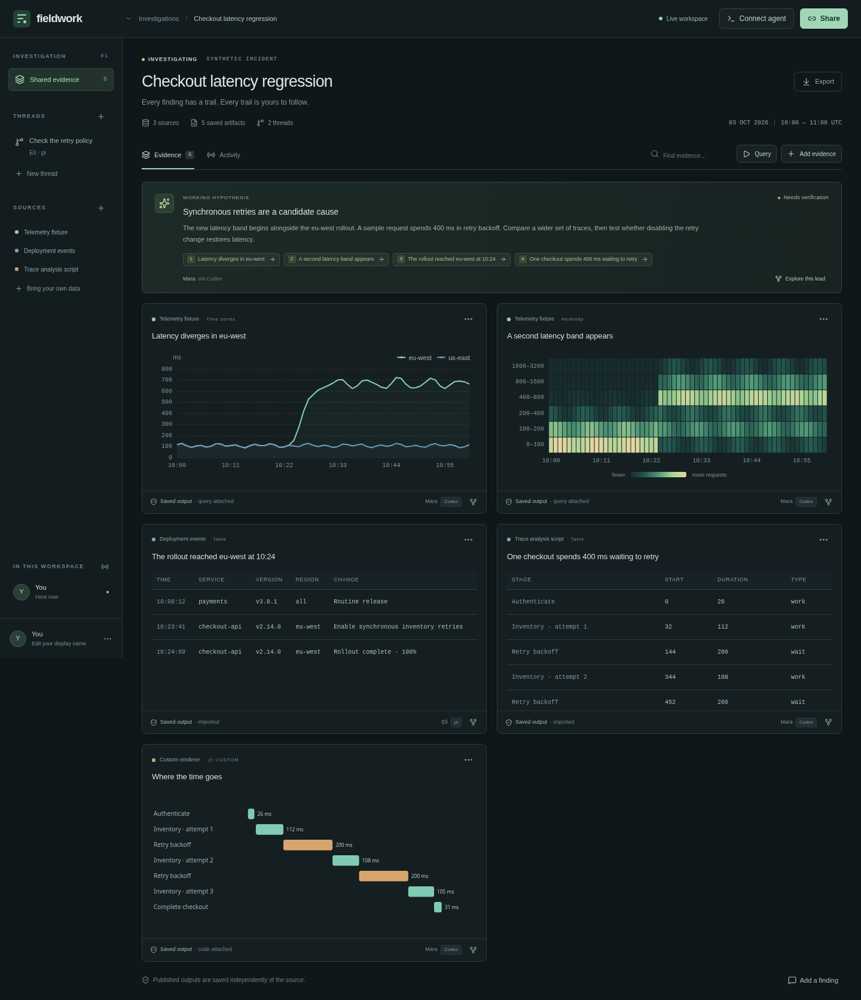

# Fieldwork

A shared investigation workspace for people and their own agents. Built as a Cloudflare-deployable proof of concept.

Keep using Codex, pi, OpenCode, scripts, and whichever data sources help. Publish the useful evidence into a durable room: the actual result, its known origin, optional query or instructions, a useful view, and links to the observations it builds on. Colleagues can inspect the same evidence, fork a thread, and continue with their own tools.

## Try it

Requires Node.js 24 or newer.

    npm ci
    npm run dev

Open http://localhost:5173 and choose **Explore an example**. No account, API key, or model subscription is required locally. The incident is explicitly synthetic; storage, collaboration, agent integration, and custom component execution are real.

The development command runs Vite on port 5173 and Wrangler on 8787. Local Durable Object and R2 data persists in .wrangler/state. Use **npm run preview** to build and serve the production application on port 8787 instead.

Try these flows:

1. Inspect a chart to see its saved query, result, capture time, and data hash.
2. Drag across a chart and investigate that time range. Rerun an artifact to create a new revision.
3. Open the room's **Share** link in another browser. Publish an observation and watch it arrive in both.
4. Fork a thread. Its inherited evidence is a fixed snapshot; future work can proceed independently.
5. Import arbitrary JSON from another system. A recipe is encouraged, never required.
6. Inspect the custom retry timeline and its JavaScript. Build another view over selected saved inputs.
7. Export the room, including results and component code, independently of upstream telemetry retention.

## Connect your agent

The **Connect agent** dialog supplies the connection values for a room. These are also usable by any HTTP client.

    export FIELDWORK_URL=http://localhost:5173
    export FIELDWORK_ROOM=ROOM_ID
    export FIELDWORK_KEY=ROOM_INVITE_KEY
    export FIELDWORK_ACTOR=Jeremy
    export FIELDWORK_HARNESS=codex
    export FIELDWORK_BRANCH=main

The actor and harness fields are display labels, not verified identities. Each investigator can set their own.

    npm run --silent agent -- state
    npm run --silent agent -- query --file examples/query.json
    npm run --silent agent -- publish --file examples/import.json
    npm run --silent agent -- get EVIDENCE_ID
    npm run --silent agent -- fork EVIDENCE_ID --title "Check the retry policy"
    npm run --silent agent -- component --code examples/render.js --input EVIDENCE_ID
    npm run --silent agent -- changes --after 0
    npm run --silent agent -- export --output investigation.json

Writes accept an optional **--idempotency-key** so an agent can retry after a disconnected tool call without duplicating an artifact. Forking returns a branch ID; set FIELDWORK_BRANCH to publish there.

For an MCP-capable harness, run the stdio server with Node and the same environment. Adapt the outer configuration to your harness:

    {
      "mcpServers": {
        "fieldwork": {
          "command": "node",
          "args": ["/absolute/path/to/turbo-octo-carnival/scripts/mcp.mjs"],
          "env": {
            "FIELDWORK_URL": "http://localhost:5173",
            "FIELDWORK_ROOM": "ROOM_ID",
            "FIELDWORK_KEY": "ROOM_INVITE_KEY",
            "FIELDWORK_ACTOR": "Jeremy",
            "FIELDWORK_HARNESS": "codex"
          }
        }
      }
    }

No model runs inside Fieldwork. The agent reads the room, uses its existing tools, and contributes through MCP or the CLI. See the [agent guide](docs/agent-guide.md) and [API and architecture](docs/architecture.md).

## Sources and reproducibility

| Path | What gets recorded |
| --- | --- |
| Synthetic telemetry adapter | Resolved query, absolute time window, and result |
| Cloudflare Workers Observability adapter | Native query body, fixed API endpoint, capture time, and full response envelope |
| Import from any tool | Actual JSON output, supplied source details, and optional rerun instructions |
| Custom component | Saved input artifact IDs, JavaScript source, validated drawing, and an SVG snapshot |
| Finding | Interpretation, status, and cited evidence IDs |

Captured and imported origins are labeled differently. A hash proves which saved JSON a view used; it does not prove the source's truthfulness. Deterministic execution is not a condition of publication. Reruns are new observations, not replacements for history.

To enable the optional Cloudflare adapter locally, create a .dev.vars file:

    CF_OBSERVABILITY_ACCOUNT_ID=your-account-id
    CF_OBSERVABILITY_API_TOKEN=your-read-only-telemetry-token

The adapter calls the Workers Observability telemetry query endpoint with an absolute timeframe and dry=true. It preserves the raw response; an agent can publish a chart-shaped transformation or create a custom view over it. The native Cloudflare integration has not been exercised against a live account in this environment.

This PoC uses one operator-configured Cloudflare account. Every holder of a room key can query that account through the adapter. Per-user source permissions and OAuth are future work; existing agent tools remain another way to collect data.

## Deploy on Cloudflare

The application uses Workers Static Assets, one SQLite Durable Object per room, R2 for archived artifacts, and Dynamic Workers for custom renderers. An account with access to those features is required.

    npx wrangler login
    npx wrangler r2 bucket create fieldwork-evidence
    npx wrangler secret put WORKSPACE_KEY
    npm run deploy

Set a strong workspace creation key. On the hosted landing page, expand **Hosted workspace access** to supply it. Without a configured key, hosted room creation fails closed. Existing rooms use separate, randomly generated invite keys.

For the CLI's create command, supply the creation key through FIELDWORK_WORKSPACE_KEY. Optional hosted source configuration:

    npx wrangler secret put CF_OBSERVABILITY_ACCOUNT_ID
    npx wrangler secret put CF_OBSERVABILITY_API_TOKEN

Adjust the Worker and R2 names in wrangler.jsonc if they conflict with existing resources. Deployment creates the SQLite Durable Object class through the included migration. There is no provisioned live deployment included with this repository.

## Verify

    npm run build
    npx playwright install chromium
    npm test
    node scripts/check-persistence.mjs
    npx wrangler deploy --dry-run

The integration suite runs against real local workerd, SQLite DOs, R2, Dynamic Workers, independent browser sessions, and the CLI/MCP clients. It checks collaboration, snapshots and reruns, provenance, access boundaries, renderer restrictions, chart selection, and mobile layout. The persistence check uses temporary storage on port 8791, stops and restarts workerd, and verifies the production build under its security policy. CI also runs the build and tests.

## PoC boundaries

- Room links grant read and edit access to the entire room. There is no SSO, role model, invite revocation, or artifact-level ACL.
- Custom code runs in a network-disabled Dynamic Worker and returns a small, validated SVG drawing. This is an extensible rendering contract, not a general browser application runtime. Built-in charts provide interactive selections.
- Native source capture is bounded to 1 MiB per artifact and 1,000 artifacts per room. Binary uploads, room discovery/search, shared component packages, and deletion workflows are not implemented.
- Immutability is enforced by this application's append-only API and fresh R2 object IDs. Years-long retention needs an operational backup and retention policy. Storage administrators can still delete data; the bucket is not configured as WORM storage.
- Export includes the original data and custom SVG snapshots. It is not a self-contained copy of the interactive website.

The underlying idea comes from [Extensible Software in the Age of LLMs](https://jeremymorrell.dev/blog/extensible-software-in-the-age-of-llms/): the product should provide a trustworthy shared core while letting people and agents extend how they work. [Related tools and the product hypothesis](docs/landscape.md) compares the overlap with Honeycomb Canvas, Grafana, Deepnote, and Cloudflare OS.
